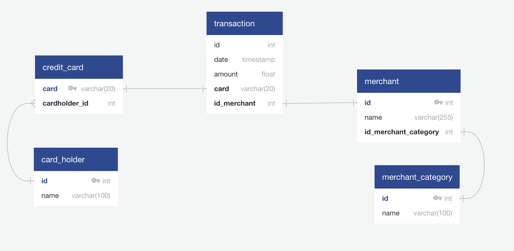

## SQL Fraud Detection

## Description

Fraud is prevalent these days, whether you are a small taco shop or a large international business. While there are emerging technologies that employ machine learning and artificial intelligence to detect fraud, many instances of fraud detection still require strong data analytics to find abnormal charges.

In this homework assignment, you will apply your new SQL skills to analyze historical credit card transactions and consumption patterns in order to identify possible fraudulent transactions.

You are asked to accomplish three main tasks:

1. [Data Modeling](#Data-Modeling):
Define a database model to store the credit card transactions data and create a new PostgreSQL database using your model.

2. [Data Engineering](#Data-Engineering): Create a database schema on PostgreSQL and populate your  database from the CSV files provided.

3. [Data Analysis](#Data-Analysis): Analyze the data to identify possible fraudulent transactions trends data, and develop a report of your observations.

---

## Files to model in a database

* [card_holder.csv](Data/card_holder.csv)
* [credit_card.csv](Data/credit_card.csv)
* [merchant.csv](Data/merchant.csv)
* [merchant_category.csv](Data/merchant_category.csv)
* [transaction.csv](Data/transaction.csv)


## Data Analysis
[visual_data_analysis](Starter_Files/visual_data_analysis.ipynb)

### Data Modeling

```
card_holder
---
id int PK 
name varchar(100)

credit_card
---
card varchar(20) PK
cardholder_id int FK >- card_holder.id


merchant
---
id int PK
name varchar(255)
id_merchant_category int FK - merchant_category.id

merchant_category
---
id int PK
name varchar(100)


transaction
---
id int
date timestamp
amount float
card varchar(20) FK - credit_card.card
id_merchant int FK - merchant.id
```


